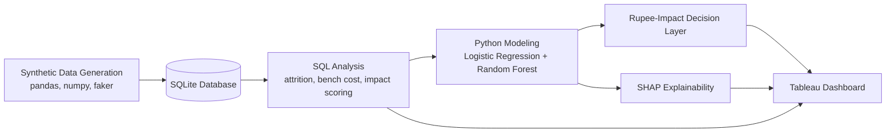

# Workforce Attrition & Bench Utilization Analytics

An end-to-end people-analytics project that predicts employee attrition risk, quantifies its financial impact in rupees, and recommends where retention spend actually pays off — built on a synthetic but industry-benchmarked dataset.


**[Try the Live Interactive App →](https://01-workforce-attrition-analytics-qvzzylzdmpxaqzr2squqtf.streamlit.app)**

## Business Problem
Employee attrition and idle "bench" time are two of the most expensive, least visible costs in IT-services organizations. Replacing an employee typically costs a significant fraction of their annual salary, and unassigned bench time generates cost without generating revenue. This project builds a system to anticipate attrition and act on it early, with a dollar-and-cents lens instead of a purely descriptive one.

Full write-up: [`docs/business_problem.md`](docs/business_problem.md)

## Architecture



Data flows from synthetic generation into SQLite, gets analyzed via SQL, feeds two ML models compared on ROC-AUC, is explained via SHAP, translated into a financial decision layer, and finally surfaced in an interactive Tableau dashboard.

## What's Inside

| Step | Description |
|---|---|
| 1 | Repo structure, environment setup |
| 2 | Business problem definition |
| 3 | Synthetic dataset generation (`pandas`, `numpy`, `faker`) — 1,000 employees |
| 4 | SQL analysis: attrition by department, bench cost, employee impact scoring |
| 5 | Logistic Regression attrition prediction model |
| 6 | Interactive Tableau dashboard (actions, tooltips, parameters, story points) |
| 7 | Model comparison (Logistic Regression vs. Random Forest) + SHAP explainability |
| 8 | Rupee-impact decision layer — ROI-based retention recommendations |
| 8.5 | Synthetic data benchmarked against real NASSCOM industry attrition figures |
| 9 | Plain-language executive summary |

## Key Results
- **Best model:** selected via ROC-AUC comparison between Logistic Regression and Random Forest
- **Explainability:** SHAP values show `bench_days`, `salary`, and `performance_enc` as the top drivers of attrition risk
- **Decision layer:** flags the ~22% of at-risk employees where the expected cost of losing them exceeds the cost of intervening — turning a blanket retention effort into a targeted one


## SQL Highlights

**Bench days vs. attrition rate** — the query that proves bench time is a leading indicator of attrition, not just a cost center:

```sql
SELECT
  CASE
    WHEN b.bench_days = 0 THEN '0 days'
    WHEN b.bench_days BETWEEN 1 AND 30 THEN '1-30 days'
    WHEN b.bench_days BETWEEN 31 AND 60 THEN '31-60 days'
    ELSE '60+ days'
  END AS bench_bucket,
  COUNT(*) AS total_employees,
  SUM(e.attrition_flag) AS attrition_count,
  ROUND(100.0 * SUM(e.attrition_flag) / COUNT(*), 2) AS attrition_rate_pct
FROM employee_master e
JOIN bench_allocation b ON e.employee_id = b.employee_id
GROUP BY bench_bucket
ORDER BY MIN(b.bench_days);
```

**Employee impact score** — ranks current (non-attrited) employees by potential loss if they left, weighting replacement cost by tenure:

```sql
SELECT e.employee_id, e.name, e.department, e.performance_rating, e.tenure_years, e.salary,
       f.replacement_cost_estimate,
       ROUND(f.replacement_cost_estimate * (1 + e.tenure_years/10.0), 0) AS impact_score
FROM employee_master e
JOIN finance_cost f ON e.employee_id = f.employee_id
WHERE e.attrition_flag = 0
ORDER BY impact_score DESC
LIMIT 20;
```

All 4 core queries (attrition by department, bench cost by department, impact scoring, bench-days-to-attrition correlation) are in [`sql/01_attrition_bench_analysis.sql`](sql/01_attrition_bench_analysis.sql).

## Repository Structure
```
├── data/           # Synthetic datasets (employee master, bench allocation, finance cost)
├── sql/            # SQL analysis queries + database
├── notebooks/      # Data generation, modeling, SHAP, decision layer
├── dashboard/      # Tableau workbook (.twb/.twbx)
├── docs/           # Business problem, benchmarking note, executive summary
└── images/         # Dashboard and chart exports
```

## Documentation
- [Business Problem](docs/business_problem.md)
- [Data Benchmarking Note](docs/data_benchmarking_note.md)
- [Executive Summary](docs/executive_summary.md)

## Live App
A Streamlit app is deployed for interactive, no-install exploration: department comparisons, a live attrition-risk predictor, and the full filterable decision layer table.
**[Launch the app →](https://01-workforce-attrition-analytics-qvzzylzdmpxaqzr2squqtf.streamlit.app)**

## Dashboard
The interactive Tableau dashboard file is available in [`dashboard/`](dashboard/) — open with Tableau Desktop or Tableau Public (free) to explore live.

## Tools Used
Python (pandas, numpy, scikit-learn, SHAP, faker) · SQL (SQLite) · Tableau · GitHub

## Author
[Anchal Jha](https://github.com/ANCHAL23-WEB)
