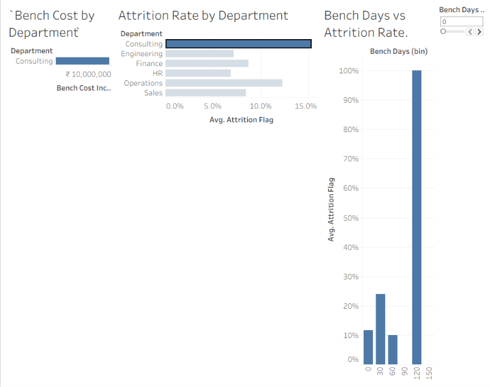
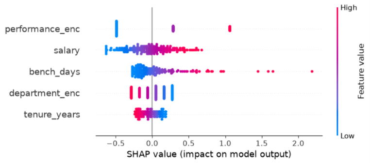

# Workforce Attrition & Bench Utilization Analytics

An end-to-end people-analytics project that predicts employee attrition risk, quantifies its financial impact in rupees, and recommends where retention spend actually pays off — built on a synthetic but industry-benchmarked dataset.



## Business Problem
Employee attrition and idle "bench" time are two of the most expensive, least visible costs in IT-services organizations. Replacing an employee typically costs a significant fraction of their annual salary, and unassigned bench time generates cost without generating revenue. This project builds a system to anticipate attrition and act on it early, with a dollar-and-cents lens instead of a purely descriptive one.

Full write-up: [`docs/business_problem.md`](docs/business_problem.md)

## What's Inside

| Step | Description |
|---|---|
| 1 | Repo structure, environment setup |
| 2 | Business problem definition |
| 3 | Synthetic dataset generation (`pandas`, `numpy`, `faker`) — 1,000 employees |
| 4 | SQL analysis: attrition by department, bench cost, employee impact scoring |
| 5 | Logistic Regression attrition prediction model |
| 6 | Interactive Tableau dashboard (actions, tooltips, parameters, story points) |
| 7 | Model comparison (Logistic Regression vs. Random Forest) + SHAP explainability |
| 8 | Rupee-impact decision layer — ROI-based retention recommendations |
| 8.5 | Synthetic data benchmarked against real NASSCOM industry attrition figures |
| 9 | Plain-language executive summary |

## Key Results
- **Best model:** selected via ROC-AUC comparison between Logistic Regression and Random Forest
- **Explainability:** SHAP values show `bench_days`, `salary`, and `performance_enc` as the top drivers of attrition risk
- **Decision layer:** flags the ~22% of at-risk employees where the expected cost of losing them exceeds the cost of intervening — turning a blanket retention effort into a targeted one



## Repository Structure
```
├── data/           # Synthetic datasets (employee master, bench allocation, finance cost)
├── sql/            # SQL analysis queries + database
├── notebooks/      # Data generation, modeling, SHAP, decision layer
├── dashboard/      # Tableau workbook (.twb/.twbx)
├── docs/           # Business problem, benchmarking note, executive summary
└── images/         # Dashboard and chart exports
```

## Documentation
- [Business Problem](docs/business_problem.md)
- [Data Benchmarking Note](docs/data_benchmarking_note.md)
- [Executive Summary](docs/executive_summary.md)

## Dashboard
The interactive Tableau dashboard file is available in [`dashboard/`](dashboard/) — open with Tableau Desktop or Tableau Public (free) to explore live.

## Tools Used
Python (pandas, numpy, scikit-learn, SHAP, faker) · SQL (SQLite) · Tableau · GitHub

## Author
[Anchal Jha](https://github.com/ANCHAL23-WEB)
